# Math1231: Maple Lab Test Questions & Solutions

These solutions have been extracted from the 2016s2 maple lab practice test. These notes are in no way affiliated with UNSW's School of Mathematics nor UNSW's MathSoc. I highly recommend you try doing the practice questions yourself and use these notes if your really stuck.
Maple 18 was used to generate the solutions.

## Question 1
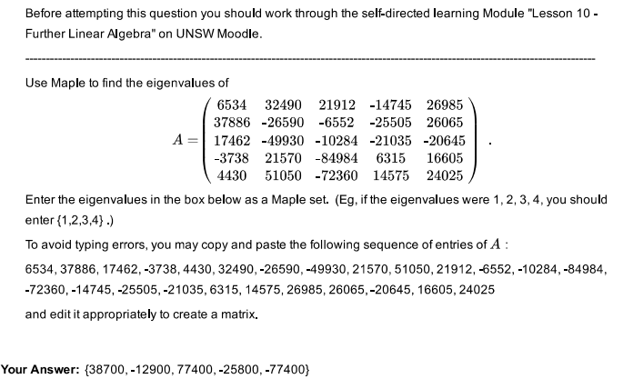
```R
with(LinearAlgebra): # Include the LinearAlgebra package, if not already loaded.
A := <<6534, 37886, 17462, -3738, 4430> | <32490, -26590, -49930, 21570, 51050> | <21912, -6552, -10284, -84984, -72360> | <-14745, -25505, -21035, 6315, 14575> | <26985, 26065, -20645, 16605, 24025>>;
Eigenvalues(A);
```

## Question 2
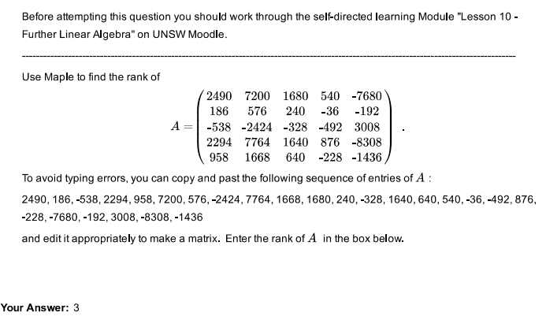
```R
with(LinearAlgebra): # Include the LinearAlgebra package, if not already loaded.
A := <<2490, 186, -538, 2294, 958> | <7200, 576, -2424, 7764, 1668> | <1680, 240, -328, 1640, 640> | <540, -36, -492, 876, -228> | <-7680, -192, 3008, -8308, -1436>>;
Rank(A);
```

## Question 3
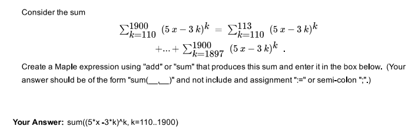
```R
sum((5*x -3*k)^k, k=110..1900):
```

## Question 4
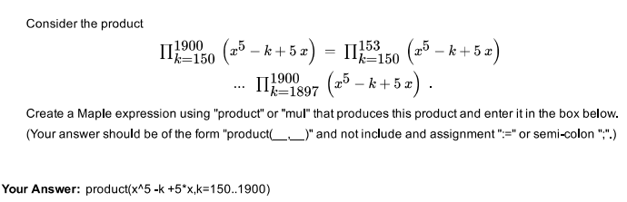
```R
product(x^5 -k +5*x,k=150..1900):
```

## Question 5
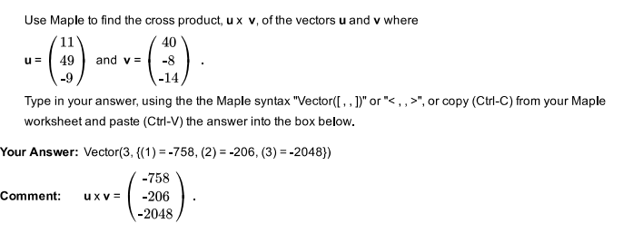
```R
with(LinearAlgebra): # Include the LinearAlgebra package, if not already loaded.
u:=<11,49,-9>; v:=<40,-8,-14>;
CrossProduct(u,v);
```

## Question 6
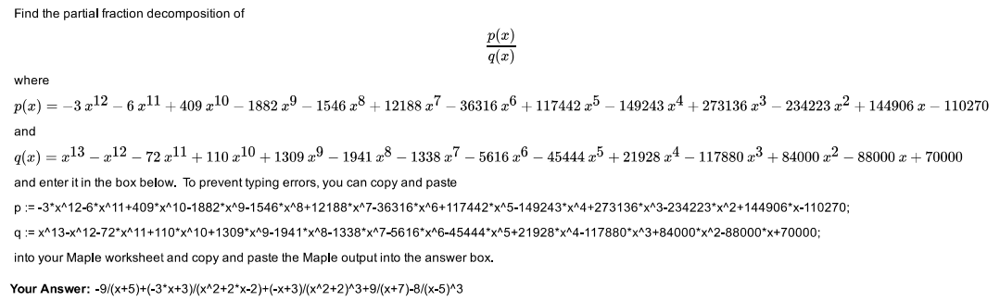
```R
p := -3*x^12-6*x^11+409*x^10-1882*x^9-1546*x^8+12188*x^7-36316*x^6+117442*x^5-149243*x^4+273136*x^3-234223*x^2+144906*x-110270;
q := x^13-x^12-72*x^11+110*x^10+1309*x^9-1941*x^8-1338*x^7-5616*x^6-45444*x^5+21928*x^4-117880*x^3+84000*x^2-88000*x+70000;
convert(p/q, parfrac, x);

         9       -3 x + 3      -x + 3       9        8
     - ----- + ------------ + --------- + ----- - --------
       x + 5    2                     3   x + 7          3
               x  + 2 x - 2   / 2    \            (x - 5)
                              \x  + 2/
```

## Question 7
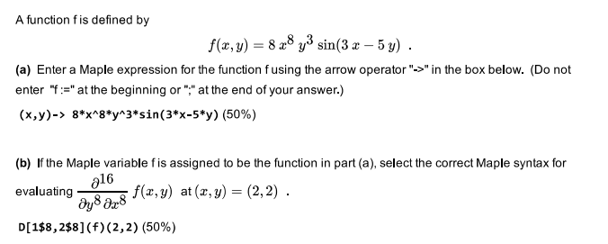
```R
f := (x,y)-> 8*x^8*y^3*sin(3*x-5*y);
D[1$8, 2$8](f)(2,2) # where x is 1$ and y is 2$
```

## Question 8
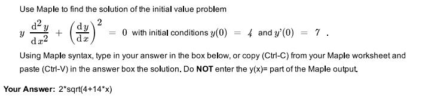
```R
ODE := y(x)*diff(y(x),x$2) + diff(y(x),x)^2 = 0;
dsolve({ODE, y(0)=4, D(y)(0)=7}, y(x));

                                       (1/2)
                    y(x) = 2 (4 + 14 x)
```

## Question 9
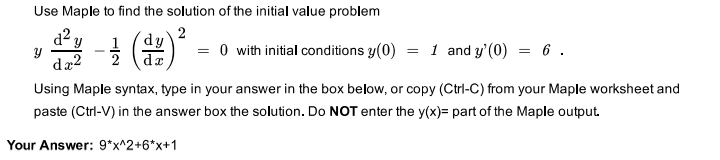
```R
ODE := y(x)*diff(y(x),x$2) - 1/2*diff(y(x),x)^2 = 0;
dsolve({ODE, y(0)=1, D(y)(0)=6}, y(x));
                               2
                     y(x) = 9 x  + 6 x + 1
```

## Question 10
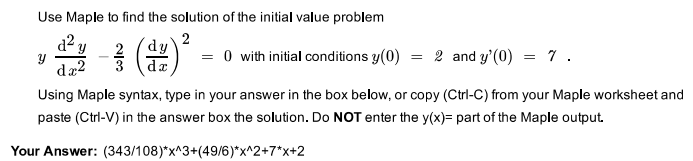
```R
ODE := y(x)*diff(y(x), x$2) -2/3*diff(y(x),x)^2 = 0;
dsolve({ODE, y(0)=2, D(y)(0)=7}, y(x));

                       343  3   49  2
                y(x) = --- x  + -- x  + 7 x + 2
                       108      6
```

## Question 11
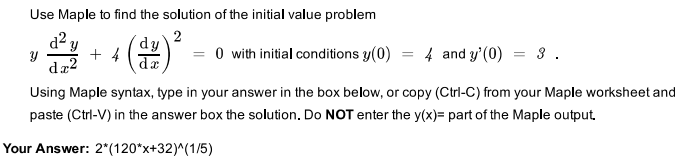
```R
ODE := y(x)*diff(y(x),x$2) + 4*diff(y(x),x)^2 = 0;
dsolve({ODE, y(0)=4, D(y)(0)=3}, y(x));
                                        (1/5)
                   y(x) = 2 (120 x + 32)
```

## Question 12
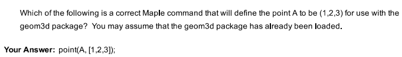

## Question 13
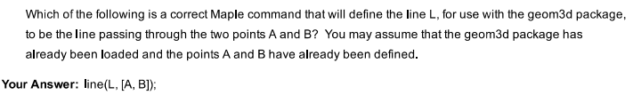

## Question 14
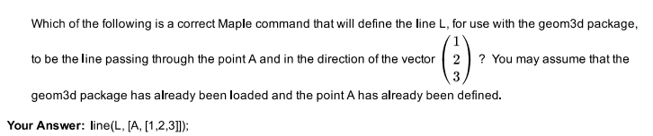

## Question 15
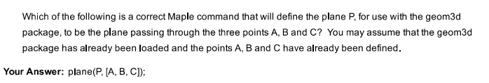

## Question 16
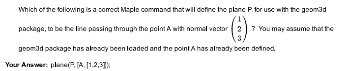

## Question 17
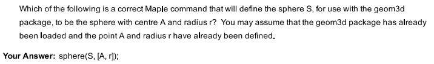

## Question 18


## Question 19
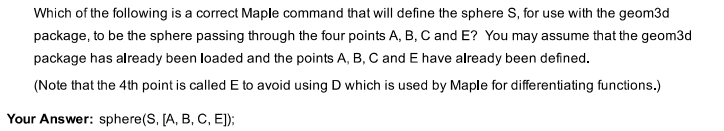

## Question 20
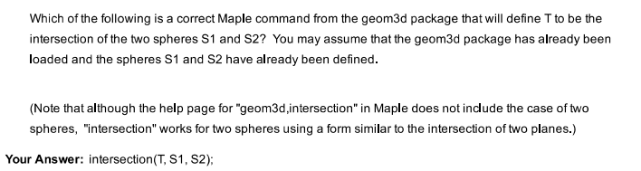

## Question 21
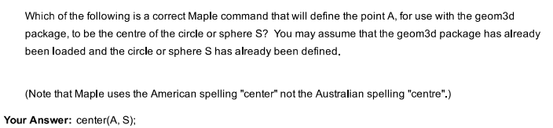

## Question 22
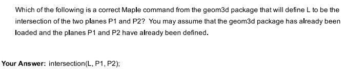

## Question 23


## Question 24
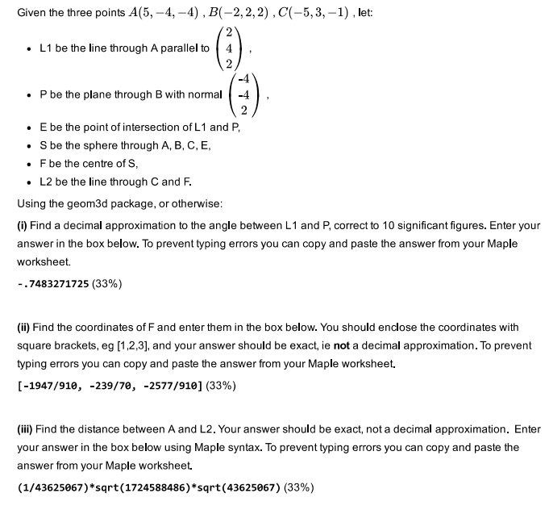
```R
restart; # clear memory as we need to reuse the A variable OR use A := 'A'
with(geom3d): # Load the geom3d package, if not already loaded.
point(A, [5,-4,-4]); point(B, [-2,2,2]); point(C, [-5,3,-1]);
line(L1, [A, [2,4,2]]);
plane(P, [B, [-4,-4,2]]);
intersection(E, L1, P);
sphere(S, [A,B,C,E]);
center(F, S);
line(L2, [C,F]);
evalf[10](FindAngle(L1,P));
                         -0.7483271725
coordinates(F);
                      [-1947  -239  -2577]
                      [-----, ----, -----]
                      [ 910    70    910 ]
distance(A, L2);
                1               (1/2)         (1/2)
             -------- 1724588486      43625067
             43625067
```

## Question 24
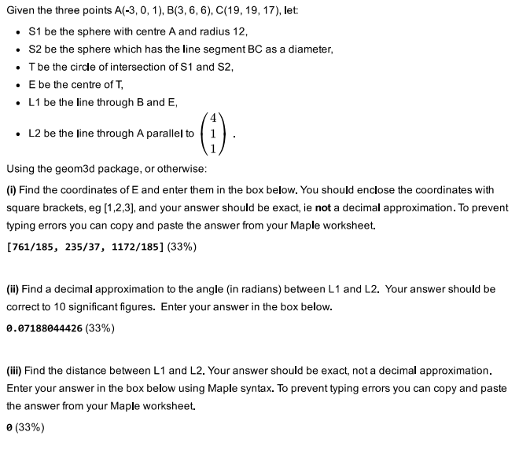
```R
restart; # clear memory as we need to reuse the A variable OR use A := 'A'
with(geom3d): # Load the geom3d package, if not already loaded.
point(A, [-3,0,1]); point(B, [3,6,6]); point(C, [19,19,17]);
sphere(S1, [A,12]);
sphere(S2, [B,C])
intersection(T, S1, S2);
center(E, T);
line(L1, [B,E]);
line(L2, [A, [4,1,1]]);
coordinates(E);
                      [ 761    235   1172]
                      [-----, ----, -----]
                      [ 185    37    185 ]
evalf[10](FindAngle(L1,L2));
                         0.07183271725
distance(L1, L2);
0
```

## Question 26
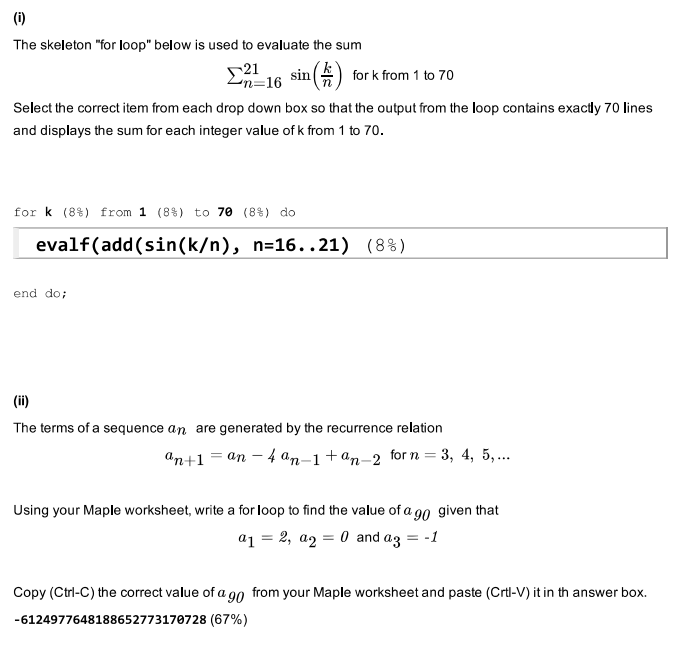
```R
restart; # clear memory
a := proc(n)     # shift + enter
      local a,i;     # shift + enter
      a[1]:=2;     # shift + enter
      a[2]:=0;     # shift + enter
      a[3]:=-1;     # shift + enter
      for i from 3 to n-1 do     # shift + enter
          a[i+1]:=a[i]-4*a[i-1]+a[i-2]     # shift + enter
      end do;     # shift + enter
      return a[n]     # shift + enter
    end proc;     # shift + enter
    a(90);
                       -6124977648188652773170728
>>>
```


## Question 27
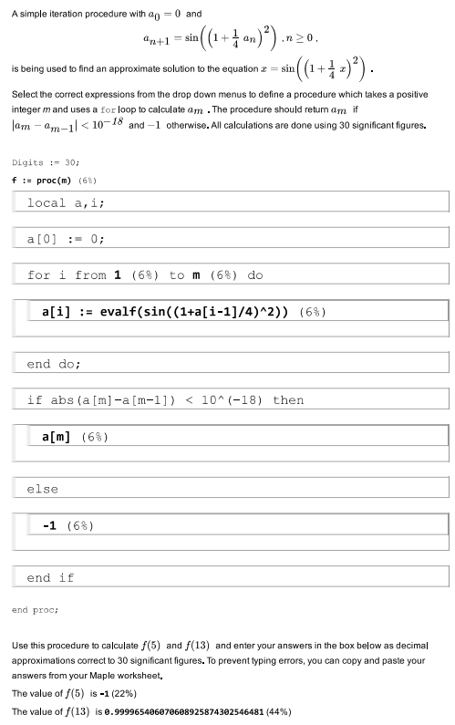
```R
restart; # clear memory
Digits := 30;                             # shift + enter
    f := proc(m)                              # shift + enter
      local a,i;                              # shift + enter
      a[0]:=0;                                # shift + enter
      for i from 1 to m do                    # shift + enter
          a[i] := evalf(sin((1+a[i-1]/4)^2))    # shift + enter
      end do;                                 # shift + enter
      if abs(a[m]-a[m-1]) < 10^(-18) then     # shift + enter
          a[m]                                  # shift + enter
      else                                    # shift + enter
          -1                                    # shift + enter
      end if                                  # shift + enter
    end proc;                                 # shift + enter
f(5);
                         -1
f(13);
          0.999965406070608925874302546481
```